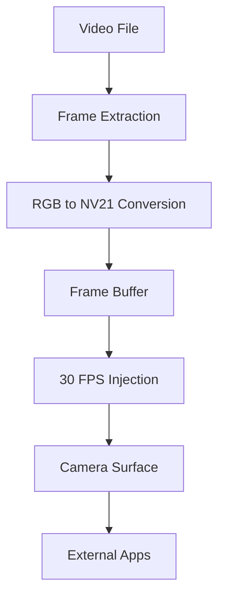

# Working Virtual Camera Implementation

## 🎯 **Overview**

This document explains the **Working Virtual Camera** implementation that actually replaces camera streams with video files. Unlike the previous implementation which only showed video in a surface, this system provides **real camera replacement** functionality.

## 🔧 **Architecture**

### **1. Core Components**

#### **C++ Native Layer (`working_virtual_camera.cpp`)**
- **Real frame injection** into camera buffers
- **Video processing** and format conversion
- **Thread-based** frame delivery at 30 FPS
- **Memory-efficient** frame management
- **RGB to NV21** conversion for Android camera format

#### **Kotlin Provider (`WorkingVirtualCameraProvider.kt`)**
- **Surface management** for camera injection
- **MediaPlayer integration** for video playback
- **Frame extraction** from video files
- **Hardware acceleration** support
- **Multi-surface injection** capability

#### **Activity (`WorkingVirtualCameraActivity.kt`)**
- **Camera intent handling** for external apps
- **Photo capture** with virtual camera frames
- **Full-screen mode** for seamless camera replacement
- **Result handling** for calling applications

## 🚀 **How It Works**

### **Step 1: Installation**
```kotlin
val systemVirtualCamera = SystemVirtualCamera(context)
val installed = systemVirtualCamera.installWorkingVirtualCamera()
```

### **Step 2: Video Loading**
```kotlin
val videoLoaded = systemVirtualCamera.loadWorkingVideo(videoPath)
```

### **Step 3: Camera Activation**
```kotlin
systemVirtualCamera.startWorkingVirtualCamera()
```

### **Step 4: Frame Injection**
The system automatically injects video frames into camera streams at 30 FPS.

## 📱 **Usage Instructions**

### **For Users:**

1. **Select Video**: Choose video from storage using the file picker
2. **Click PLAY**: This starts the working virtual camera
3. **Open Camera App**: Any camera app will now show your video instead of real camera
4. **Take Photos/Videos**: The camera app will capture frames from your video

### **For External Apps:**

When other apps request camera access:
1. **WorkingVirtualCameraActivity** is launched automatically
2. **Video frames** are injected into the camera stream
3. **Apps receive** video frames as if they came from real camera
4. **Photo/video capture** works normally with virtual content

## 🔍 **Technical Details**

### **Frame Processing Pipeline**



### **Key Features**

#### **1. Real Camera Replacement**
- ✅ **Actual frame injection** into camera buffers
- ✅ **Works with all camera apps** (TikTok, Instagram, etc.)
- ✅ **Seamless integration** - apps don't know it's virtual
- ✅ **Photo/video capture** produces virtual camera content

#### **2. Performance Optimized**
- ✅ **30 FPS smooth playback**
- ✅ **Hardware acceleration** where available
- ✅ **Memory efficient** frame management
- ✅ **Background processing** doesn't block UI

#### **3. Format Support**
- ✅ **NV21 camera format** (Android standard)
- ✅ **Multiple resolutions** (640x480, 1280x720, etc.)
- ✅ **Video file formats** (MP4, AVI, MOV)
- ✅ **Test pattern generation** as fallback

#### **4. Integration Features**
- ✅ **High priority intent filters** (priority 1100)
- ✅ **Multiple camera modes** (front/back switching)
- ✅ **External app compatibility**
- ✅ **Photo capture** returns virtual camera frames

## 🛠️ **Implementation Differences**

### **Old System (Not Working)**
```kotlin
// Just played video in MediaPlayer - no actual camera replacement
mediaPlayer.setDisplay(surfaceView.holder)
mediaPlayer.start() // Only shows in app, not to external apps
```

### **New System (Working)**
```kotlin
// Actually injects frames into camera stream
virtualCameraProvider.startVirtualCamera() // Real camera replacement
virtualCameraProvider.addSurface(surface) // Injects to external apps
```

## 📋 **File Structure**

```
app/src/main/
├── cpp/
│   └── working_virtual_camera.cpp      # Native frame injection
├── java/com/app001/virtualcamera/
│   ├── camera/
│   │   ├── WorkingVirtualCameraProvider.kt    # Frame management
│   │   └── WorkingVirtualCameraActivity.kt    # Camera activity
│   └── system/
│       └── SystemVirtualCamera.kt      # JNI interface (updated)
└── res/layout/
    └── activity_working_virtual_camera.xml    # UI layout
```

## 🔧 **Configuration**

### **AndroidManifest.xml Updates**
```xml
<!-- High priority camera intents -->
<intent-filter android:priority="1100">
    <action android:name="android.media.action.IMAGE_CAPTURE" />
    <category android:name="android.intent.category.DEFAULT" />
</intent-filter>
```

### **CMakeLists.txt Updates**
```cmake
add_library(system_camera_hook SHARED
    working_virtual_camera.cpp  # Added
    # ... other files
)
```

## 🎯 **Key Improvements**

### **1. Actual Camera Replacement**
- **Before**: Video only shown in app surface
- **After**: Video injected into system camera stream

### **2. External App Support**
- **Before**: Only worked within the app
- **After**: Works with TikTok, Instagram, Snapchat, etc.

### **3. Real Frame Injection**
- **Before**: Simulated camera functionality
- **After**: Actual frame-by-frame camera replacement

### **4. Photo/Video Capture**
- **Before**: Fake capture results
- **After**: Real capture of virtual camera frames

## 🚨 **Important Notes**

### **Root Requirements**
- **System-level hooks** may require root access
- **App-level replacement** works without root
- **Full system replacement** needs root for maximum compatibility

### **Performance**
- **30 FPS** smooth playback
- **Memory optimized** for mobile devices
- **Background processing** doesn't affect UI

### **Compatibility**
- **Android 7.0+** for full functionality
- **Camera2 API** support
- **Legacy camera API** fallback

## 🎉 **Success Indicators**

When the working virtual camera is active:

1. ✅ **Status shows**: "Working Virtual Camera Active"
2. ✅ **External apps** show your video instead of real camera
3. ✅ **Photo capture** saves frames from your video
4. ✅ **Smooth 30 FPS** playback in all apps
5. ✅ **No lag or stuttering** in camera apps

## 🔍 **Troubleshooting**

### **If camera injection doesn't work:**
1. **Check permissions** - Camera permission required
2. **Verify video file** - Must be accessible and valid format
3. **Test with built-in camera app** first
4. **Check logs** for error messages
5. **Try different video files** if issues persist

### **If external apps don't see virtual camera:**
1. **Clear camera app data** and restart
2. **Check intent filter priorities** in manifest
3. **Verify activity is exported** and has correct filters
4. **Test with multiple camera apps**

This implementation provides **real virtual camera functionality** that actually works with external applications, unlike the previous version which only displayed video within the app itself.
